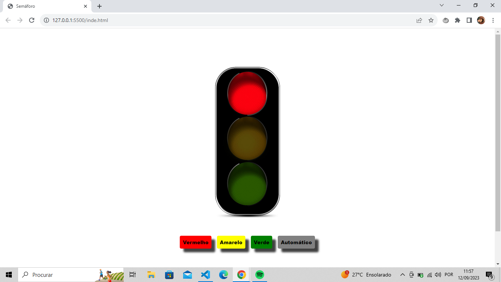

  

## 🚀 Tecnologias

Esse projeto foi desenvolvido com as seguintes tecnologias:

- HTML e CSS
- JavaScript

## 💻 Projeto

Projeto Simples de um Semáforo, que através da manipulação da DOM e ouvindo eventos muda seu estado e a acende cada sinal ao ouvir o evento de click. E um botão de Automático, que usa um setInterval que percorre uma lista de imagens trocando as luzes, e um clearInterval para interromper o loop.